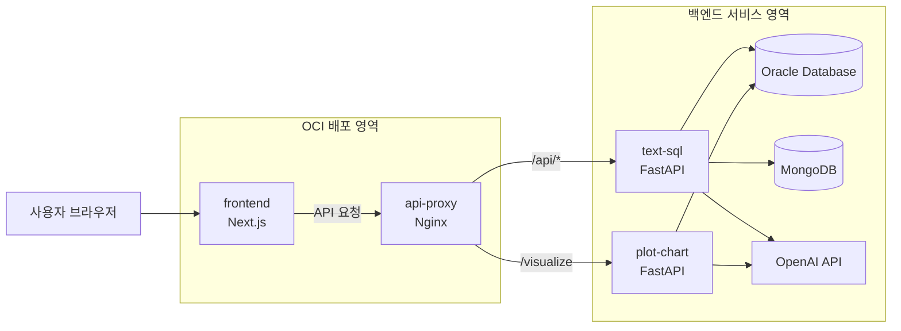

# QueryLENs

임상 연구진을 위한 자연어 기반 NL2SQL + 시각화 + PDF 코호트 분석 통합 서비스입니다.

## 기본 정보
- 서비스명: `QueryLENs`
- 기간: `January 23, 2026 18:00 ~ February 26, 2026 16:00`

## 기획 배경
- 임상 연구진이 SQL을 직접 작성하지 않아도 자연어 질문으로 데이터에 접근하도록 지원합니다.
- MIMIC-IV 기반 분석의 반복 작업(코호트 조건 확인, 집계, 시각화)을 단축합니다.
- 결과를 통계/차트/해석으로 제공하여 의사결정 인사이트 도출을 돕습니다.

## 주요 기능
- Text-to-SQL
  - 자연어 질문 -> SQL 생성
  - 쿼리 실행 및 결과 미리보기
- Query Visualization
  - 결과 테이블 기반 차트 추천/생성
  - 통계표 및 시각화 인사이트 제공
- 코호트 분석 (PDF LLM 포함)
  - PDF 논문 기준 코호트 조건 추출
  - 코호트 SQL 생성/시뮬레이션
- 대시보드 저장
  - 쿼리 결과/차트/요약을 폴더 단위로 저장 및 조회

## 기술 스택 (실제 코드 기준)
- Frontend: `Next.js`, `React`, `TypeScript`, `Tailwind CSS`, `Plotly`
- Backend API: `FastAPI`, `Uvicorn`, `Pydantic`, `Pandas`
- Data: `Oracle Database`, `MongoDB`
- LLM: `OpenAI API`
- Infra: `Docker`, `Docker Compose`

## 아키텍처
### 서비스 흐름
- `frontend` -> `text-sql(FastAPI)` -> `Oracle / MongoDB / OpenAI`
- `frontend` -> `plot-chart(FastAPI)` -> `OpenAI / Oracle`

### 전체 아키텍처 설계도


### Docker 네트워크
- 단일 브리지 네트워크 `query-lens-net` 사용
- 컨테이너 간 서비스명 기반 통신
  - UI -> Text-to-SQL: `http://text-sql:8000`
  - UI -> Visualization: `http://plot-chart:8080`

## 폴더 구조 (재편 후)
```text
root
├── frontend
├── backend
│   ├── text-to-sql
│   │   ├── backend/app
│   │   │   ├── api/routes
│   │   │   ├── services
│   │   │   └── core
│   │   └── var
│   └── query-visualization
│       └── src
│           ├── api
│           ├── agent
│           ├── db
│           └── utils
├── db
│   └── ddl
├── docker
│   ├── frontend.Dockerfile
│   ├── text-sql.api.Dockerfile
│   └── query-visualization.api.Dockerfile
└── docker-compose.yml
```

## 실행 방법
루트에서 아래 한 줄로 전체 서비스 실행:

```bash
docker-compose up --build
```

상태 확인:

```bash
docker-compose ps
```

종료:

```bash
docker-compose down
```

## 환경변수 설명
### 1) 루트 `.env`
- `TEXT_SQL_HOST_PORT`: Text-to-SQL 외부 노출 포트
- `VIS_API_HOST_PORT`: Visualization API 외부 노출 포트
- `UI_HOST_PORT`: UI 외부 노출 포트

### 2) `backend/text-to-sql/.env`
- Oracle 연결: `ORACLE_*`
- OpenAI/모델/보호 정책: `OPENAI_*`, `*_MODEL`, `DB_TIMEOUT_SEC` 등
- RAG/Mongo: `MONGO_*`, `RAG_*`

### 3) `backend/query-visualization/.env`
- OpenAI: `OPENAI_*`
- Oracle: `ORACLE_*`
- 큐/요청 제한: `VIS_QUEUE_*`, `VIS_*`

## API 엔드포인트 요약
### Text-to-SQL (`text-sql`)
- Health
  - `GET /health`
- Query
  - `POST /query/oneshot`
  - `POST /query/run`
  - `POST /query/answer`
  - `POST /query/transcribe`
  - `GET /query/get`
  - `GET /query/demo/questions`
- Audit
  - `GET /audit/logs`
  - `DELETE /audit/logs/{log_id}`
- Dashboard
  - `GET /dashboard/queries`
  - `POST /dashboard/queries`
  - `POST /dashboard/saveQuery`
  - `POST /dashboard/queryBundles`
- Cohort/PDF
  - `POST /cohort/simulate`
  - `POST /cohort/sql`
  - `GET/POST/PATCH/DELETE /cohort/library...`
  - `POST /pdf/upload`
  - `GET /pdf/status/{task_id}`
  - `GET /pdf/history`

### Visualization (`plot-chart`)
- `GET /health`
- `GET /db-test`
- `POST /visualize`

## Backend 도메인 분리 내역
기존 비즈니스 로직 보존 원칙에 따라 내부 함수 재작성 없이 **경로 정리 중심**으로 분리했습니다.

- Text-to-SQL 도메인: `backend/text-to-sql/backend/app/services/*`
- Visualization 도메인: `backend/query-visualization/src/agent`, `backend/query-visualization/src/api`
- PDF LLM 도메인: `backend/text-to-sql/backend/app/services/pdf_service.py` 및 연관 route

참고: 본 프로젝트는 기존에 FastAPI 기반 서비스가 이미 분리되어 있어, 단일 Express 인스턴스로 강제 통합하면 로직 변경 범위가 커집니다. 최소 침습 원칙에 맞춰 서비스 경계를 유지했습니다.

## 실행 안정성 보완 내역
```json
[
  {
    "area": "backend",
    "issue": "text-to-sql app.main의 dashboard 중복 import",
    "riskLevel": "LOW",
    "fix": "중복 import 1건 제거"
  },
  {
    "area": "backend",
    "issue": "query-visualization API의 CORS 미설정",
    "riskLevel": "MEDIUM",
    "fix": "CORS_ALLOW_ORIGINS 기반 CORSMiddleware 추가"
  },
  {
    "area": "frontend",
    "issue": "QueryView의 localhost 하드코딩 fallback",
    "riskLevel": "MEDIUM",
    "fix": "NEXT_PUBLIC_API_BASE_URL 또는 same-origin rewrite만 사용"
  },
  {
    "area": "docker",
    "issue": "UI 단일 스테이지 이미지 크기 증가",
    "riskLevel": "LOW",
    "fix": "frontend Dockerfile을 multi-stage(builder/runner)로 전환"
  }
]
```

## 팀원 역할 정리 (기술 기여 중심)
| 팀원 | 역할 | 기여 내용 |
| --- | --- | --- |
| **박소현 (팀장)** | `Lead / Full-Stack` |  |
| **박채린** | `PM / 기획` |  |
| **고민정** | `Full-Stack` |  |
| **배성경** | `AI / RAG` |  |

## 구조 정리 및 개선 요약
- 루트 구조를 `frontend / backend / db / docker` 중심으로 재배치
- Dockerfile 경로를 `docker/*`로 통합
- `docker-compose.yml`의 build context / env_file / volume 경로를 재배치 구조에 맞게 수정
- UI-Backend 연결을 컨테이너 서비스명 기준으로 정리 (`text-sql`, `plot-chart`)
- 기능/비즈니스 로직 재작성 없이 실행 경로와 운영 안정성 위주로 최소 수정

## OCI 서버 배포 가이드
> 상세 Runbook: `DEPLOY-OCI.md`
> 대상 인스턴스: `instance-team9 (146.56.175.190)`

### 1. 사전 준비
- OCI 서버에 Docker/Compose 설치
- KEY 파일 준비: `./instance-team9.key`
- 루트 `.env` 설정:
  - `FRONTEND_PORT=8000`
  - `API_PORT=80`
  - `BACKEND_URL=http://host.docker.internal:4000` (또는 `http://<LOCAL_IP>:<PORT>`)
  - `OCI_HOST=146.56.175.190`

### 2. 최초 배포
```bash
./scripts/deploy-oci.sh
```

접속 링크:
- Frontend: `http://146.56.175.190:8000`
- API Health: `http://146.56.175.190/api/health`

### 3. 재배포 (frontend만 / api만)
```bash
docker compose build frontend && docker compose up -d frontend
docker compose build api && docker compose up -d api
```

### 4. 상태 확인
```bash
./scripts/check-oci.sh
```

### 5. 로컬 backend 연결 방법
- 권장: VPN/공인 IP 또는 SSH Reverse Tunnel (`ssh -R`) 기반 연결
- 1회 설정(OCI):
```bash
ssh -i instance-team9.key opc@146.56.175.190 \
  "echo 'GatewayPorts clientspecified' | sudo tee /etc/ssh/sshd_config.d/querylens-tunnel.conf >/dev/null && sudo systemctl restart sshd"
```
- 터널 실행(기본: 로컬 `8002` -> OCI `4000`):
```bash
./scripts/start-oci-tunnel.sh
```

### 6. 자주 발생 문제
- `api/health` 실패: `BACKEND_URL`, 로컬 backend 상태, `./scripts/start-oci-tunnel.sh` 실행 상태 확인
- `frontend` 미접속: OCI 보안 목록/NSG 포트(80, 8000) 확인
